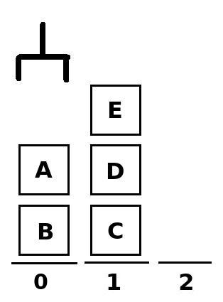

# TC2011 - Uninformed Search Lab

## Setup

Before you begin, perform the following two steps:

- [Install autograder](https://github.com/rhomeister/autograder#for-students)
- [Setup your git repository](https://github.com/rhomeister/autograder#installation)


## The Container Crane Problem

For this lab, you have to build a solver for the 'container crane'
problem.



Imagine the port
of Rotterdam, in which containers are picked up and moved by automatic cranes.
One of the goals of the cranes is to organize containers in stacks, such that
containers that will be transported first are put on the top of the stacks. In
that way, it is easier to reach them than had they been at the bottom of a
stack.

For the sake of simplicity, we will assume that there is a container terminal
with a single crane, and `n` stacks of containers.

In the diagram below, you can see an example state of the containers. The
containers are labeled A to E, and the stacks (possible positions) of the
containers are labeled 0, 1 and 2. The crane can pick up a single container at a
time, and move it to a different stack. Stacks are not allowed to be higher than
a certain length, depending on the problem (see below).

### Objective 

Your assignment is to build a solver that returns a sequence of movements that
the crane has to make to get the stack of containers from the initial state to
the goal state. This sequence of movements has to _minimize the time to get the
containers in the right place_.

### The Cost function

Every movement takes time to execute. This is calculated as follows:

- Picking up the container takes 0.5 minutes
- Moving the container one stack to the left or right takes 1 minute.
- Putting the container down takes 0.5 minutes

Example: moving a container from stack 2 to stack 4 takes `0.5 + abs(2 - 4) + 0.5 = 3`
minutes.

### Input/Output
Your program must read from `stdin` and output to `stdout`. See
[here](https://github.com/rhomeister/autograder#the-required-structure-of-a-project)
for instructions how to do this.

Basically, your program will be called by executing `run < [problem_file]`,
where `problem_file` is a file describing the problem (see below). Your program
should output the solution as text to the terminal.

#### Input

The input consists of three lines:

1. The maximum height of a stack. At no point during operation, a stack of
   containers may exceed this height.
2. The initial location of the containers. Containers are labeled with letters.
   Stacks are surrounded by parenthesis, and separated by semi-colons (`;`). 
   Containers in each stacks are separated by a comma (`,`) and appear _from 
   bottom to top_.
3. The goal state of the containers. This is the same as 2, except that instead
   of a stack of containers, an `X` may appear. This means that it doesn't
   matter in which containers are in that stack, or in which order they are.

For example, for the containers in the picture above, line 2 would contain 
`(B, A); (C, D, E); ()`.

#### Output

Output consists of two lines:

1. The cost of the solution
2. A list of semi-colon separated movements that the crane makes. A movement is
   encoded as `(Start, Finish)`, where `Start` is the number of the origin stack, 
   and `Finish` is the destination stack. Stacks are numbered from 0.

Exception to this rule: if there is no solution, then your program should output
`No solution found`

### Example

In the following example:
- Stacks can be at most 2 containers high.
- There are three stacks with 1 container. Stack 0 contains A, stack 1 contains B
  and stack 2 contains C.
- The goal is to have container B on top of container A in stack 0. The rest of
  the stacks don't matter.

Input:
```
2
(A); (B); (C)
(A, B); X; X
```


Output:
```
2
(1, 0)
```

More examples can be found in the `testcases` directory


